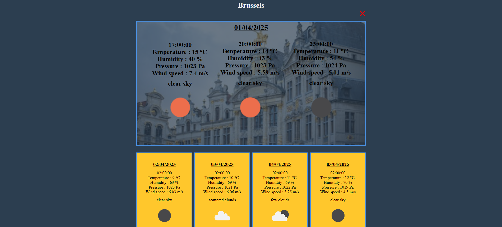

# Project of a weather APP

## Welcome to my weather APP !!!

### How it is made ?

This project is made by Vite with the prepocessor SASS and the API [openweathermap](https://openweathermap.org/).

I also used the [Unsplash Api](https://unsplash.com/developers) to display a pictures of the city each time you display the weather of this city.

All the Api requests and display of the weather is made in Vanilla Javascript.

### What it looks ?

You need to enter the name of the city you want to see the weather here in the input.

And the weather will display here, you can display more than one city's weather.

#### Let's try it click =>[here](https://patoucheh.github.io/weather-app/)

##### Thank you for reading it and please wait I'm in progress on this project
